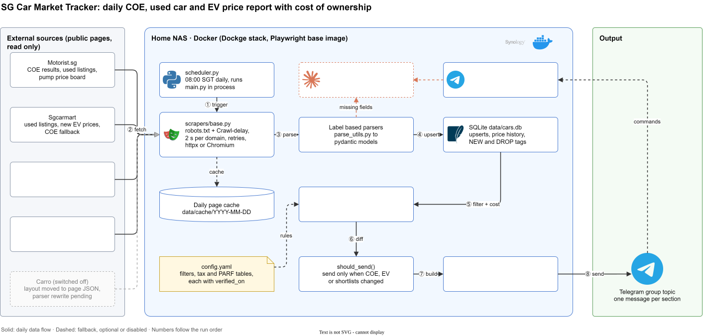

# SG Car Market Tracker

A self hosted Docker service that scrapes the Singapore car market every morning (COE results, used car listings, new EV prices, pump prices, top selling brands), filters and ranks the cars against your criteria, works out the real cost of ownership, and posts the report to a Telegram topic, only when something changed.




<sub>Editable source: [`docs/architecture.drawio`](docs/architecture.drawio). PNG fallback: [`docs/architecture.png`](docs/architecture.png).</sub>

## Why this exists

Buying a car in Singapore means tracking a COE price that moves every two weeks, used listings spread over several portals, and a cost model (ARF, PARF rebate, road tax bands, VES and EEAI rebates, MAS loan limits) that no listing site shows in one place. Checking all of that by hand every day is tedious. This service does it once a day on a home NAS and sends a short, ranked report with a link to every car.

## Highlights

| Decision | Trade off and where it lives |
|---|---|
| **Polite scraping by construction.** Every fetch goes through one base class that checks `robots.txt`, honours a site's `Crawl-delay` when it is longer than our own 2 s per domain gap, retries with exponential backoff, and caches each page per day. | A full run takes about an hour because Sgcarmart asks for 30 s between requests. Accepted: slow and allowed beats fast and blocked. `scrapers/base.py` |
| **Label based parsers instead of CSS selectors.** Fields are found by their visible labels ("Mileage", "COE", "OMV") and number patterns. | Survives most cosmetic redesigns. Structural changes still break it, so every parser has a saved HTML fixture and a test. `scrapers/parse_utils.py`, `fixtures/` |
| **LLM as a bounded fallback, not a dependency.** When a listing page loses required fields, the page text goes to `claude -p` with no tools, no session, trimmed input and a hard cap of 20 calls per run. | Keeps the report working through a layout change while the parser is fixed. If the CLI is missing or fails, the run carries on without it. `ai.py`, `config.yaml` `ai` |
| **Send only on change.** A signature of the COE, new EV and used shortlist sections is compared with the last report that went out. Optional heartbeat after N quiet days. | Daily runs keep price history growing without daily noise. `pipeline.py` `should_send` |
| **Idempotent reruns.** Upserts into SQLite, a daily page cache under `data/cache/YYYY-MM-DD/`, and a sent flag per run date. | A crash or manual rerun on the same day never double posts. `--force` overrides. `db.py`, `main.py` |
| **Failure isolation per source.** Each scraper failure marks its section unavailable and the run continues. COE sources are tried in order (Motorist, then LTA, then Sgcarmart). | One broken site never kills the whole report. `pipeline.py` |
| **All assumptions in config, each with a `verified_on` date.** Filters, road tax bands, PARF schedules, ARF tiers, loan rules, insurance bands. | Policy changes (for example the February 2026 PARF cut) are a YAML edit, not a code change, and staleness is visible. `config.yaml`, `costs.py` |

## How it works

The numbers match the diagram.

1. **Trigger.** `scheduler.py` runs `main.py` daily at `general.schedule_time` (08:00 SGT). `bot_listener.py` can also start a run from Telegram (`/run`, `/coe`, `/filters`).
2. **Fetch.** Scrapers pull from Motorist, Sgcarmart and LTA through `BaseScraper` (httpx, or Playwright Chromium for rendered pages), with robots.txt checks, throttling, retries and the daily cache.
3. **Parse.** Label based parsers turn pages into pydantic models (`models.py`). Missing required fields optionally go to the Claude CLI fallback.
4. **Store.** `db.py` upserts COE results, new EV variants, used listings with price history, and fuel prices into `data/cars.db`, and marks listings that disappeared.
5. **Filter and cost.** `filters.py` applies the hard filters (price ceiling, mileage per year, owners, COE years left, flag words) and ranks by value. `costs.py` computes road tax, depreciation, PARF, energy, insurance band, deposit and instalment.
6. **Diff.** `should_send()` compares the watched sections with the last sent report.
7. **Build.** `report.py` builds the sections (summary, COE position, Best Selling Top EV by body type, Used EV and Used petrol Best Value lists, Top sellers, Pump prices, cost of ownership). `telegram_bot.py` renders fixed width tables and splits at Telegram's 4096 character limit.
8. **Send.** One message per section to the chat, or to a forum topic when `TELEGRAM_THREAD_ID` is set.

## Tech stack

| Layer | Tech |
|---|---|
| Language | Python 3.11+, managed with `uv` |
| Scraping | httpx, Playwright (Chromium), selectolax, tenacity, pypdf (LTA M03 registrations PDF) |
| Models and config | pydantic v2, PyYAML, python-dotenv |
| Storage | SQLite (`data/cars.db`) |
| Delivery | Telegram Bot API (send and long polling) |
| Optional AI | Claude Code CLI in print mode (`claude -p`) |
| Runtime | Docker Compose on a Synology NAS (Dockge stack), image based on `mcr.microsoft.com/playwright/python` |
| Tests | pytest, fixture pages, local mock Telegram API for end to end |

## Getting started

### Prerequisites

* Python 3.11+ and [uv](https://docs.astral.sh/uv/) (or plain `pip install -r requirements.txt`)
* Chromium for Playwright: `uv run playwright install chromium`
* A Telegram bot token from `@BotFather` and your chat id. Message the bot once, then open `https://api.telegram.org/bot<TOKEN>/getUpdates` and read `"chat":{"id":...}`.

### Configure

```bash
cp .env.example .env
```

| Key | Required | Purpose |
|---|---|---|
| `TELEGRAM_BOT_TOKEN` | yes | Bot token from BotFather |
| `TELEGRAM_CHAT_ID` | yes | Target chat. For a forum supergroup it is `-100<chat>` |
| `TELEGRAM_THREAD_ID` | no | Forum topic id. The listener then only answers inside that topic |
| `SCRAPER_CONTACT` | no | Added to the User Agent so site owners can reach you |
| `CLAUDE_CODE_OAUTH_TOKEN` or `ANTHROPIC_API_KEY` | no | Only if you use the `ai` block and do not sign in interactively |

Never commit `.env`. Filters, searches and cost assumptions live in `config.yaml`.

### Run locally

```bash
uv sync
uv run python main.py --sample --dry-run   # sample report, no network, no sending
uv run python main.py --dry-run            # scrape everything and print the report
uv run python main.py --section coe --dry-run
uv run python main.py                      # scrape and send (only if something changed)
uv run python main.py --force              # ignore today's cache and resend
uv run python main.py --since 2026-09-20   # NEW and DROP tags relative to a date
```

### Deploy on a NAS with Docker

```bash
docker compose up -d --build
docker compose logs -f
```

* `RUN_ON_START=1` sends a report as soon as the container starts, which doubles as the delivery test. `RUN_LISTENER=1` answers `/run`, `/coe` and `/filters`.
* The project folder is bind mounted at `/app`, so a code or config update is copy the files and restart. A `requirements.txt` change needs a rebuild (`pull_policy: build` does that on every `up`).
* `mem_limit: 1536m` and `shm_size: 512m` cap Chromium so a runaway page cannot starve the NAS. The image is about 2 GB because of Chromium.
* Optional Claude CLI sign in, stored in `data/claude/` on the host so it survives rebuilds:

  ```bash
  docker compose exec -it sg-car-scraper claude auth login
  ```

A GitHub Actions alternative is in `.github/workflows/daily.yml`: 00:00 UTC schedule, `data/cars.db` kept in the actions cache (evicted after 7 idle days), secrets as repository secrets.

## Project structure

```
main.py, scheduler.py       CLI entry point and the daily scheduler used in the container
bot_listener.py             optional Telegram command listener
pipeline.py                 runs scrapers, persists results, builds sections, change detection
filters.py, costs.py        used car filters and ranking, cost of ownership engine
report.py, telegram_bot.py  section builders, fixed width tables, message splitting
db.py, models.py            SQLite schema and upserts, pydantic records
ai.py                       bounded Claude CLI helper (field fallback, analyst note)
scrapers/                   base.py (robots, throttle, retry, cache) plus one module per source
config.yaml                 every filter, formula and assumption, with verified_on dates
fixtures/                   saved HTML pages, including live captures, used by parser tests
tests/                      pytest suite (15 test modules)
docs/                       architecture diagram and the Obsidian vault (docs/vault/)
```

## Testing and quality

```bash
uv run pytest
```

Latest local run: **100 passed** in about 34 s. The suite covers:

* every parser against a fixture in `fixtures/` (hand built and live captures)
* every filter and every cost formula with known inputs, and the next tender date calculation
* the Telegram formatter: length limit, table width, link numbering, balanced `<pre>` blocks
* database upserts, change detection and the scheduler
* `tests/test_e2e.py`: the whole program end to end, with a local web server serving fixtures under each site's URL patterns, Chromium rendering, and a local mock of the Telegram Bot API. It also proves a same day rerun is idempotent and that `--force` resends.

### When a site changes layout

1. Save the live page into `fixtures/<site>_<kind>.html` (today's copy is already in `data/cache/YYYY-MM-DD/`).
2. Run `uv run pytest tests/test_<scraper>.py`. The failing assertion names the field that stopped parsing.
3. Fix the parser, usually a new label synonym or link pattern, then run the full suite and a dry run.

## Design decisions and limitations

* **Carro is switched off.** Its fuel filter stopped filtering in 2026 and listings now sit in escaped page JSON. The old parser and fixtures remain; the search URLs are commented out in `config.yaml` until the JSON parser is written.
* **Cnergy no longer publishes prices online.** The section says so instead of reporting a daily failure. Pump prices come from Motorist's grade board.
* **Parsers need upkeep.** Many fixtures were first written by hand before the sites could be reached. COE, Motorist and the Sgcarmart used and new EV parsers have since been reworked against live pages, but expect periodic parser maintenance as sites change.
* **Slow by design.** Sgcarmart's 30 s Crawl-delay makes a full run take about an hour. Move `schedule_time` earlier if the report arrives too late.
* **New EV range is estimated** as battery kWh times km per kWh. Claimed WLTP figures can be added in `config.yaml`.
* **Insurance bands are indicative**, and tender dates shifted by public holidays are not modelled.
* **Without a Claude CLI login** every run spends its 20 call budget on failures. Sign in or set `ai.enabled: false`.
* **Terms of use.** COE and fuel pages are public and low volume. Sgcarmart, Carro and Motorist are commercial classifieds whose terms likely restrict automated access, so this is a personal, low volume tool that honours `robots.txt` and never bypasses CAPTCHAs, anti bot measures or logins. LTA's data.gov.sg COE dataset is a scraping free alternative for COE. Remove any source from `config.yaml` if its owner objects.

Policy figures (road tax formula, PARF schedules including the February 2026 change, ARF tiers, LTV limits, VES and EEAI) were checked on 2026-09-29 and are dated in `config.yaml`.

---

<OWNER> · [GitHub](https://github.com/gcjk768)
